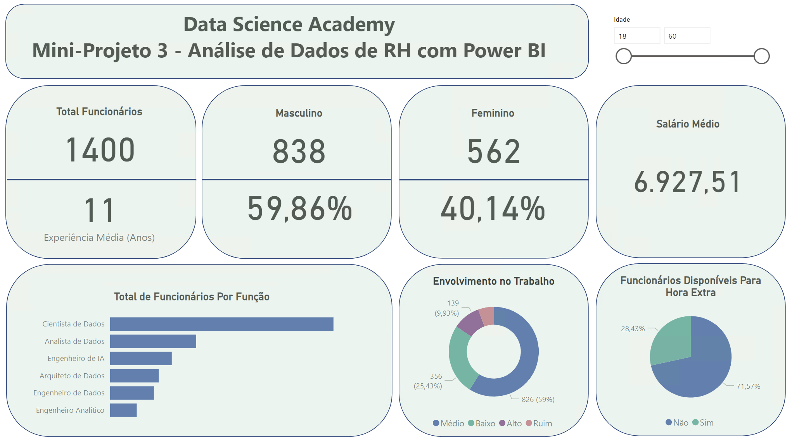

## Conteúdo do Capítulo 06

### Mini Projeto 3: Análise de Dados de RH com Power BI

Foi cedido um arquivo `.csv` contendo dados relacionados ao setor de RH com o objetivo de extrair KPIs e montar um painel como o exemplo abaixo:
  
#### Anotações:
Os dados categóricos nas colunas [Indice_Envolvimento_Trabalho] e [Disponivel_Hora_Extra] foram alterados, respectivamente, de 1-2-3-4 para Ruim-Baixo-Médio-Alto e S-N para Sim-Não.
Após assistir as aulas tomei ciência da "tabela de medidas", e integrei-a ao meu projeto final.
Também empreguei formatações sugeridas pelo instrutor adequando-as ao meu modelo pessoal.